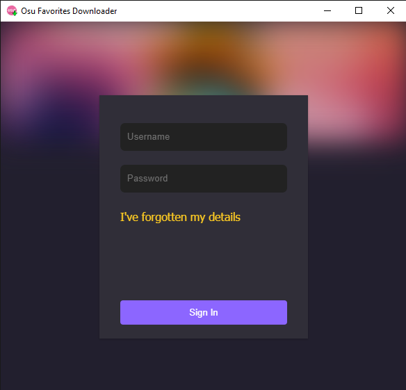

<h1 align="center">
    Unofficial Osu Favorites Downloader
</h1>

Project made with Electron for the functionalities and React for the interface. Unofficial Osu Favorites Downloader is a program to download the user's favorites maps of the musical game [Osu!](Https://osu.ppy.sh/home) with just one click.

## How to use

- Download the [program](https://github.com/wykke/osu-favorites-downloader/releases/tag/1.0.0).
- Sign in.
- Choose the offset, the amount of beatmaps and if you want to download with video.
    - The offset represents where in the list you will start downloading, it is useful when you stop a download and want to continue later.
    - The choice of video download refers to the video that appears in the background when playing a song.
- Click download and done.

Be careful, the osu server limits the user to 200 downloads in a row, after that you have to wait a while.

## Screenshots

## How to develop

There are some useful commands in `package.json`.

- `yarn start`: starts react, use this command before opening the electron.
- `yarn electron-compile`: compiles the files in the directory `/src/electron`, if you have made changes to that folder, use this command before opening electron.
- `yarn electron-start`: opens the electron in development mode, the interface will be provided by `http://localhost:3000`.

To compile the project for production.

- `yarn electron-build`: compiles electron files, creates static interface files through React in the directory `/build` and compiles the executable file using electron-builder.

## Possible future upgrades

- After 200 downloads, the program waits for the osu server to release more downloads and continues, instead of simply stopping the download.
- Add ReCaptcha to the login page when necessary.

